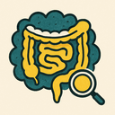

<div align="center">

# CrohnBOOST 


</div>

**CrohnBOOST** (BOwel Open-source Segmentation Tool) is a 3D Slicer extension for semi-automated segmentation of intestinal lesions and creeping fat in Crohn's disease using MRI sequences.

Developed at **IADI Laboratory, INSERM** (Université de Lorraine, Nancy, France) as part of PhD research in medical image processing.


<table>
<tr>
<th>Lesion Segmentation</th>
<th>Fat Segmentation</th>
</tr>
<tr>
<td>

<video src="https://github.com/user-attachments/assets/151bd105-a082-4a90-bd24-a495852087d6" width="100%" controls></video>

</td>
<td>

<video src="https://github.com/user-attachments/assets/5e8ed6a4-881c-4174-a668-15cede0e4303" width="100%" controls></video>

</td>
</tr>
<tr>
<td align="center"><em>Centerline-guided automatic wall detection and region growing</em></td>
<td align="center"><em>Seed-based region growing with lesion exclusion</em></td>
</tr>
</table>


## 📋 Overview

CrohnBOOST provides radiologists and researchers with advanced tools for:
- **Semi-automated intestinal wall segmentation** using centerline-guided region growing
- **Creeping fat segmentation** guided by user-placed points
- **Interactive refinement** with sensitivity/radius sliders and manual paint/erase tools 
- **Segmentation export** for downstream quantitative analysis pipelines


---
## ✨ Features

### 🎯 Lesion Segmentation
- **Centerline-based approach**: Draw a simple centerline through the lesion
- **Automatic wall detection**: Radial sampling with intensity-based wall detection
- **Smart region growing**: Adaptive thresholding with spatial constraints
- **Interactive adjustment**: Sensitivity and radius sliders with one-click update

### 🧈 Creeping Fat Segmentation
- **Seed-based growing**: Place control points in fat regions
- **Multi-sequence support**: Uses dedicated DIXON fat sequences
- **Lesion-aware**: Automatically excludes intestinal wall from fat segmentation
- **Anisotropic processing**: Respects voxel spacing for accurate 3D growth

### 🛠️ Save 

---

## 📦 Installation

### Prerequisites
- **3D Slicer** 5.6.2 or later ([Download here](https://www.slicer.org/))
- Python packages (automatically installed):
  - `scipy >= 1.7.0`
  - `numpy >= 1.21.0`
  - `vtk` (included with Slicer)

### Installation Steps

#### Method : Manual Installation
1. Clone this repository:
   ```bash
   git clone https://github.com/AntoineKneib/CrohnBOOST.git
   ```

2. In 3D Slicer:
   - Go to `Edit` → `Application Settings` → `Modules`
   - Add the path to the `CrohnBOOST` folder
   - Restart Slicer

3. The module should appear under `Modules` → `Crohn's Disease` → `CrohnBOOST`

---

## 🚀 Quick Start

### Step 1: Load Your MRI Data
1. Load your MRI sequences (Ensure volumes are co-registered)

### Step 2: Segment the Intestinal Lesion

1. **Select Input Volume**: Choose your MRI sequence
2. **Draw Centerline**: Click `Place Centerline` and trace through the lesion center
3. **Adjust Parameters**:
   - `Intestinal Radius`: Estimate of bowel diameter (default: 6mm)
   - `Sensitivity`: Control segmentation aggressiveness (0-100%, default : 50%)
4. **Click `Segmentation`**: Automatic wall detection and segmentation
5. **Refine**: Use the sensitivity slider and click `Apply` to update

### Step 3: Segment Creeping Fat

1. **Select Fat Volume**: Choose your DIXON fat sequence (inputSelector2)
2. **Place Fat Points**: Click `Place Fat Points` and add 3-5 points in the fat regions
3. **Click `Segment Fat`**: Automatic fat segmentation excluding the lesion
4. **Review**: Fat appears in yellow, lesion in beige

### Step 4: Manual Refinement (Optional)
- Use `Paint` and `Erase` tools for fine-tuning
- Compatible with 3D Slicer's Segment Editor

### Step 5: Export Results
- Click `Save Segmentation` to export as NIFTI labelmap
- Compatible with downstream quantitative analysis tools

---

## 📊 Example Results

| Centerline Drawing | Automatic Segmentation | Fat Segmentation |
|:------------------:|:----------------------:|:----------------:|
|  |  |  |

*Example: Segmentation of terminal ileum Crohn's disease with creeping fat*

---

### Parameter Guidelines

| Parameter | Typical Range | Notes |
|-----------|---------------|-------|
| Intestinal Radius | 4-8mm | Smaller for strictures, larger for dilated bowel |
| Sensitivity (lesion) | 40-60% | Lower = conservative, Higher = aggressive |
| Fat seed points | 3-10 points | More points = better coverage |

---

## 🤝 Contributing

Contributions are welcome! Please:
1. Fork the repository
2. Create a feature branch (`git checkout -b feature/AmazingFeature`)
3. Commit your changes (`git commit -m 'Add AmazingFeature'`)
4. Push to the branch (`git push origin feature/AmazingFeature`)
5. Open a Pull Request

---

## 🐛 Known Limitations

- **Manual user input required**: Not fully automatic - requires centerline drawing and seed point placement
- **User-dependent results**: Segmentation quality depends on anatomical knowledge and careful input placement
- **Refinement often needed**: Provides a solid starting point that may benefit from manual correction with paint/erase tools
- **Variable performance**: Results depend on lesion complexity, image artifacts, and user expertise

---

## 📄 License

This project is licensed under the **MIT License** - see the [LICENSE](LICENSE) file for details.

---

## 📚 Citation

If you use CrohnBOOST in your research, please cite:

```bibtex
@software{crohnboost2025,
  author       = {Kneib, Antoine},
  title        = {CrohnBOOST: Semi-Automated Segmentation Tool for Crohn's Disease MRI},
  year         = {2025},
  publisher    = {GitHub},
  url          = {https://github.com/YourUsername/CrohnBOOST},
  institution  = {IADI Laboratory, INSERM, Université de Lorraine}
}
```

*Publication in preparation - citation will be updated upon acceptance*

---

## 👤 Author

**Antoine KNEIB**  
PhD Student in Medical Image Processing  
IADI Laboratory, INSERM U1254  
Université de Lorraine, Nancy, France

📧 Contact: antoine.kneib@univ-lorraine.fr  
🔗 LinkedIn: [https://www.linkedin.com/in/antoine-kneib-b173131b8/]  

---

## 🙏 Acknowledgments

- **Supervisor**: [Dr. Freddy ODILLE and Dr. Valérie LAURENT]
- **IADI Laboratory** for research support
- **3D Slicer Community** for the amazing platform
- **Collaborators**: Dr. Astrée LEMORE, Dr. Laurent PEYRIN-BIROULET, Dr. Gabriella HOSSU
- Funded by: RHU i-DEAL (ANR-23 RHUS-0016) 

---

## 📊 Project Status


**Status**: 🚧 Active Development  
**Version**: 1.0.0-beta  
**Last Updated**: November 2025

---
If you find CrohnBOOST useful, please consider giving it a star! ⭐
---
<div align="center">
<em>Made with ❤️ for the Crohn's disease research community</em>
</div>
