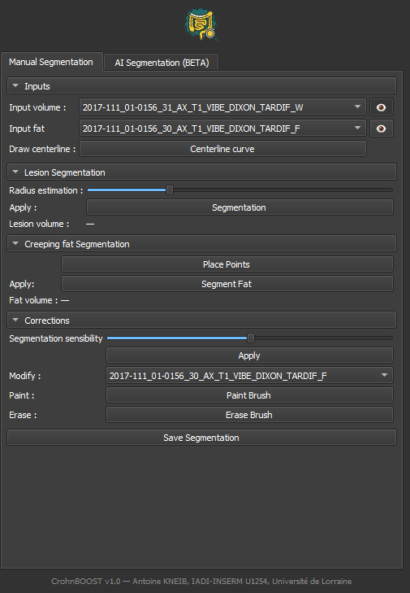

<div align="center">

# CrohnBOOST 


</div>

**CrohnBOOST** (BOwel Open Source Tool) is a 3D Slicer extension for semi-automated segmentation of intestinal lesions and creeping fat in Crohn's disease using MRI sequences.

Developed at **IADI Laboratory, INSERM U1254** (Université de Lorraine, Nancy, France) as part of PhD research in medical image processing.

<table>
<tr>
<th>Workflow Demonstration</th>
</tr>
<tr>
<td>

<video src="https://github.com/user-attachments/assets/0ea49e46-f8b0-4770-bf60-a875b6236ca1" width="100%" controls></video>

</td>
</tr>
</table>

### 🖥️ User Interface

<div align="center">



*CrohnBOOST interface in 3D Slicer — Manual Segmentation and NEW AI Segmentation (BETA) tabs*

</div>

## 📋 Overview

CrohnBOOST provides radiologists and researchers with advanced tools for:
- **Semi-automated intestinal wall segmentation** using centerline-guided region growing
- **Creeping fat segmentation** guided by user-placed points
- **Interactive refinement** with sensitivity/radius sliders and manual paint/erase tools 
- **Segmentation export** for downstream quantitative analysis pipelines
- **AI-powered automatic segmentation** using deep learning (nnU-Net) — BETA

---

## Recommended MRI Sequences

CrohnBOOST was primarily developed and validated using abdominal MRI acquired with the following sequences:

### 🟠 For Lesion Segmentation
- T1-weighted VIBE DIXON (late gadolinium-enhanced) — WATER image 
- T2 HASTE sequences

> 💡 The tool performs best when the intestinal wall appears relatively hyperintense compared to the lumen.  
> In HASTE sequences, lesions may appear darker, but segmentation remains possible. 

---

### 🟡 For Creeping Fat Segmentation
- T2 HASTE sequences can also be used
- DIXON FAT image (strongly recommended)

> ⚠️ For optimal creeping fat segmentation, the fat signal should appear hyperintense (bright).  

---

### BETA : AI Segmentation Input
The current AI model is uni-modal and lesion segmentation only, and was trained primarily on:
- Late gadolinium-enhanced T1 VIBE DIXON (WATER image)

⚠️ Using other contrasts may reduce segmentation performance ⚠️

---
## ✨ Features

### Lesion Segmentation
- **Centerline-based approach**: Draw a simple centerline through the lesion
- **Automatic wall detection**: Radial sampling with intensity-based wall detection
- **Smart region growing**: Adaptive thresholding with spatial constraints
- **Interactive adjustment**: Sensitivity and radius sliders with one-click update

### Creeping Fat Segmentation
- **Seed-based growing**: Place control points in fat regions
- **Multi-sequence support**: Uses dedicated DIXON fat sequences
- **Lesion-aware**: Automatically excludes intestinal wall from fat segmentation
- **Anisotropic processing**: Respects voxel spacing for accurate 3D growth

### Save 

### AI Segmentation (BETA)
- **One-click inference**: Automatic lesion segmentation powered by nnU-Net
- **Auto-install**: Dependencies and model downloaded automatically on first use
- **Smart CPU/GPU acceleration**: Automatically detects high-end GPUs (≥6 GB VRAM) for fast inference; seamlessly falls back to CPU on standard workstations
- **Seamless integration**: AI results compatible with manual correction tools
- > ⚠️ **Note**: AI segmentation is provided as a convenience tool. For best results, we recommend using the **manual segmentation** workflow which allows fine-grained control over the segmentation parameters. AI inference may take **5-10 minutes on CPU** depending on your hardware.
- > 📌 The AI model currently segments **intestinal lesions only**. Creeping fat segmentation still requires the manual seed-based workflow.
- > 🔬 The AI model is **uni-modal** (single MRI sequence input). For optimal results, we recommend using the **late gadolinium-enhanced T1 VIBE DIXON** sequence (water image) as input, as the model was trained primarily on this contrast.
---

### Performance Guidelines

| Hardware | Approx. Inference Time | Notes |
|----------|----------------------|-------|
| Modern CPU (i5-14600, Ryzen 7) | ~4 min | **Recommended** for most workstations |
| High-end GPU (RTX 2060+, ≥6 GB VRAM) | ~1-2 min | Automatically used when detected |
| Low-end GPU (T400, Quadro P620) | ~8 min | Slower than CPU — automatically skipped |

> 💡 CrohnBOOST automatically selects the fastest device. GPUs with less than 6 GB VRAM are skipped in favor of CPU, as inference is often faster on modern multi-core CPUs than on entry-level GPUs.

---

## Changelog

### 03/03/2026
- **AI Segmentation (BETA)**: One-click nnU-Net deep learning segmentation with automatic dependency installation and model download
- **Tabbed interface**: Separated Manual Segmentation and AI Segmentation into dedicated tabs
- **GPU/CPU fallback**: AI inference runs on GPU when available, falls back to CPU automatically

### 28/02/2026
- **Volume display**: Added automatic volume calculation (cm³ + voxels) for both lesion and creeping fat segmentations
- **Visibility toggles**: Added eye buttons to quickly switch between lesion and fat volumes in slice viewers
- **Angular interpolation**: Improved wall detection by interpolating missing angular directions using periodic polar interpolation — reduces segmentation gaps
- **Paint/Erase fix**: Fixed manual correction tools by using a dedicated hidden SegmentEditorWidget instead of accessing module internals — no more `QLayout` errors
- **Segment naming fix**: Fixed imported segments being renamed to "FullVolumeLabelMap" — now correctly keeps "Paroi_Intestinale" name and color
- **Removed auto module switch**: Segmentation no longer forces switch to Segment Editor module after completion
- **Credits footer**: Added version and credits line at bottom of the UI

---

## 📦 Installation

### Prerequisites
- **3D Slicer** 5.6.2 or later ([Download here](https://www.slicer.org/))
- Python packages (automatically installed):
  - `scipy >= 1.7.0`
  - `numpy >= 1.21.0`
  - `vtk` (included with Slicer)
- **For AI Segmentation** (auto-installed on first use):
  - `PyTorch`
  - `nnU-Net v2`

### Installation Steps

#### Method : Manual Installation
1. Clone this repository:
   ```bash
   git clone https://github.com/AntoineKneib/CrohnBOOST.git
   ```

2. In 3D Slicer:
   - Go to `Edit` → `Application Settings` → `Modules`
   - Add the path to the `CrohnBOOST` folder
   - Restart Slicer

3. The module should appear under `Modules` → `Crohn's Disease` → `CrohnBOOST`

---

## 🚀 Quick Start

### Step 1: Load Your MRI Data
1. Load your MRI sequences (Ensure volumes are co-registered)

### Step 2: Segment the Intestinal Lesion

#### Option A: Manual Segmentation
1. **Select Input Volume**: Choose your MRI sequence
2. **Draw Centerline**: Click `Place Centerline` and trace through the lesion center
3. **Adjust Parameters**:
   - `Intestinal Radius`: Estimate of bowel diameter (default: 6mm)
   - `Sensitivity`: Control segmentation aggressiveness (0-100%, default : 50%)
4. **Click `Segmentation`**: Automatic wall detection and segmentation
5. **Refine**: Use the sensitivity slider and click `Apply` to update

#### Option B: AI Segmentation (BETA)
1. **Select Input Volume** in the Manual tab
2. **Switch to AI Segmentation (BETA) tab**
3. **Click `🧠 Run AI Segmentation`**
4. Wait for automatic processing (~4 min CPU, ~1 min GPU)

### Step 3: Segment Creeping Fat

1. **Select Fat Volume**: Choose your DIXON fat sequence
2. **Place Fat Points**: Click `Place Fat Points` and add 3-5 points in the fat regions
3. **Click `Segment Fat`**: Automatic fat segmentation excluding the lesion
4. **Review**: Fat appears in yellow, lesion in orange

### Step 4: Manual Refinement (Optional)
- Use `Paint` and `Erase` tools for fine-tuning
- Compatible with 3D Slicer's Segment Editor

### Step 5: Export Results
- Click `Save Segmentation` to export as NIFTI labelmap
- Compatible with downstream quantitative analysis tools

---

## Support & Feedback

If you encounter any issue, unexpected behavior, or installation problem, please do not hesitate to contact us.

You can:
- Open an issue on this GitHub repository
- Or contact the author directly via email

We actively welcome feedback to improve CrohnBOOST.

---

## 🐛 Known Limitations

- **Manual user input required**: Not fully automatic - requires centerline drawing and seed point placement
- **User-dependent results**: Segmentation quality depends on anatomical knowledge and careful input placement
- **Refinement often needed**: Provides a solid starting point that may benefit from manual correction with paint/erase tools
- **Variable performance**: Results depend on lesion complexity, image artifacts, and user expertise
- **AI model**: Currently single-fold inference — multi-fold ensemble planned for future versions

---

## 📄 License

This project is licensed under the **MIT License** - see the [LICENSE](LICENSE) file for details.

---

## 📚 Citation

If you use CrohnBOOST in your research, please cite:

```bibtex
@software{crohnboost2025,
  author       = {Kneib, Antoine},
  title        = {CrohnBOOST: Semi-Automated Segmentation Tool for Crohn's Disease MRI},
  year         = {2025},
  publisher    = {GitHub},
  url          = {https://github.com/AntoineKneib/CrohnBOOST},
  institution  = {IADI Laboratory, INSERM, Université de Lorraine}
}
```

*Publication in preparation - citation will be updated upon acceptance*

---

## Author

**Antoine KNEIB**  
PhD Student in Medical Image Processing  
IADI Laboratory, INSERM U1254  
Université de Lorraine, Nancy, France

📧 Contact: antoine.kneib@univ-lorraine.fr  

---

## Acknowledgments

- **Supervisor**: [Dr. Freddy ODILLE and Dr. Valérie LAURENT]
- **IADI Laboratory** for research support
- **3D Slicer Forum & Community** for the amazing platform
- **Collaborators**: Dr. Astrée LEMORE, Dr. Laurent PEYRIN-BIROULET, Dr. Gabriella HOSSU
- Funded by: RHU i-DEAL (ANR-23 RHUS-0016) 

---

## Project Status


**Status**: Active Development  
**Version**: 1.0.0-beta  
**Last Updated**: March 2026

